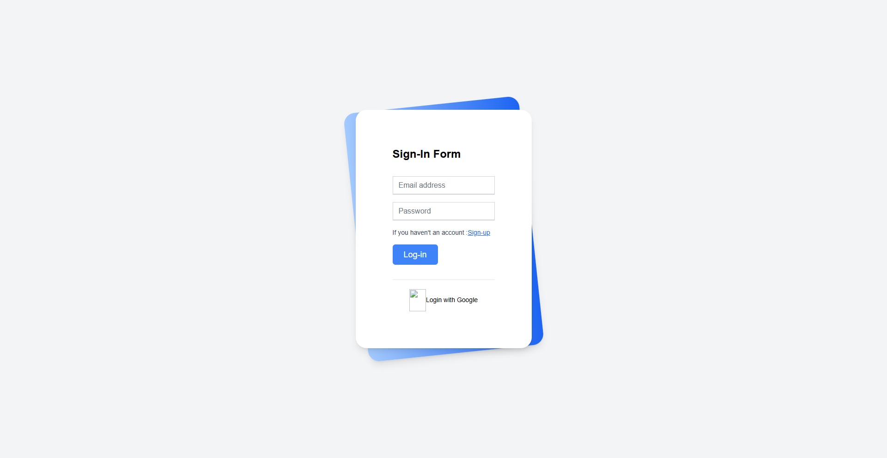
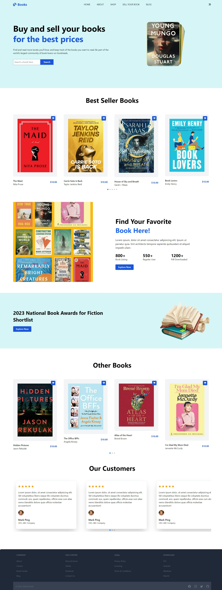

# Demo : https://book-store-app-lp07.onrender.com/


# Book Store App

## Overview
The Book Store App is a comprehensive platform designed to enhance the book-buying and selling experience. This application offers features such as browsing best-seller books, managing seller accounts, accessing promotional offers, and engaging with blog content.

## Features
- **Best Seller Books**: Discover and purchase top-rated books.
- **Seller Account**: Manage your book listings and track sales.
- **Get Promo**: Access exclusive promotional offers.
- **Blogs**: Read and engage with community-written articles.

## Tech Stack

### Backend:
- **[Concurrently](https://www.npmjs.com/package/concurrently)**: Manage multiple processes concurrently.
- **[CORS](https://www.npmjs.com/package/cors)**: Enable Cross-Origin Resource Sharing.
- **[Dotenv](https://www.npmjs.com/package/dotenv)**: Manage environment variables.
- **[Express](https://expressjs.com/)**: Build server-side RESTful APIs.
- **[MongoDB](https://www.mongodb.com/)**: Database for storing application data.
- **[Nodemon](https://www.npmjs.com/package/nodemon)**: Monitor changes in the code and automatically restart the server.

### Frontend:
- **[Firebase](https://firebase.google.com/)**: Authentication and hosting services.
- **[Flowbite-React](https://flowbite-react.com/)**: Prebuilt UI components.
- **[React](https://reactjs.org/)**: Frontend framework for building the user interface.
- **[React-Icons](https://react-icons.github.io/react-icons/)**: Icon library for React.
- **[React-Router-Dom](https://reactrouter.com/)**: Routing for navigation.
- **[Swiper](https://swiperjs.com/react)**: Carousel functionality.
- **[Tailwind](https://tailwindcss.com/)**: Utility-first CSS framework for styling.

## Installation

### Prerequisites
- Node.js installed on your machine
- MongoDB database set up

### Steps
1. Clone the repository:
   ```bash
   git clone https://github.com/your-repo/Book-Store-App.git
   ```
2. Navigate to the project directory:
   ```bash
   cd Book-Store-App
   ```
3. Install dependencies:
   ```bash
   npm install
   ```
4. Set up the `.env` file:
   ```env
   PORT=5000
   MONGO_URI=your_mongodb_connection_string
   JWT_SECRET=your_secret_key
   ```
5. Start the application:
   ```bash
   npm run dev
   ```

## Usage
- Navigate to `http://localhost:5000` to access the backend.
- Access the frontend hosted on Firebase or locally using `http://localhost:3000`.

## Screenshots

### Login Page


### Home Page


---

## License
This project is licensed under the [MIT License](LICENSE).

## Contributions
Contributions are welcome! Please follow the standard pull request process.

---

## Contact
For any inquiries, please contact [utkarshraj525@gmail.com](mailto:utkarshraj525@gmail.com).
